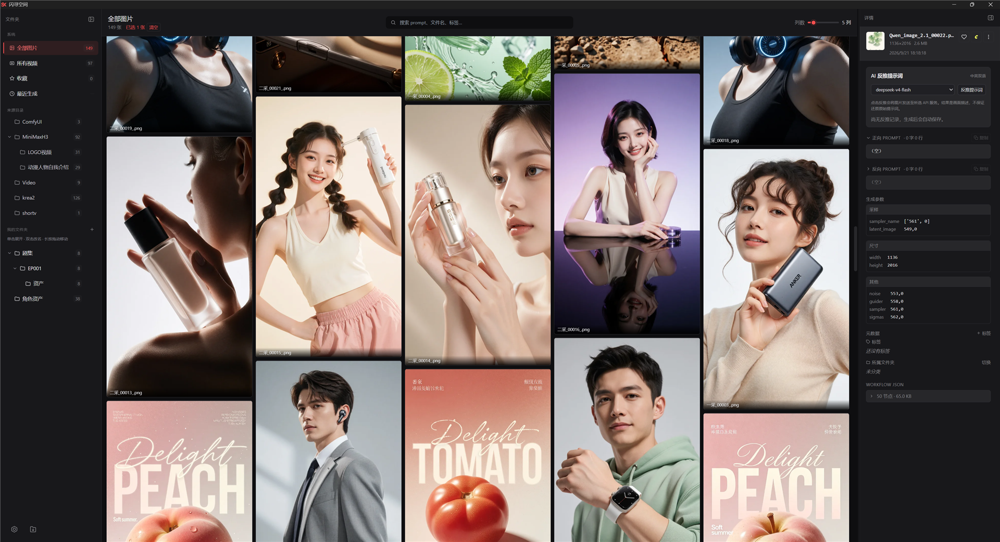

# 闪寻空间 (Seek-X)



**闪寻空间 (Seek-X)** 是面向 ComfyUI 用户的**本地图片与视频媒体管理器**。它会自动扫描你配置的目录，把 AI 生成的成品按文件夹/时间整理成瀑布流，并支持反推提示词、标签、收藏、全文搜索，以及本地视频播放与对比。

> 由「苏醒图库」更名而来，界面、数据目录与更新通道保持不变。

---

## ✨ 核心能力

### 图片 & 视频统一管理
- 三栏布局：左侧文件夹树 / 中间瀑布流缩略图 / 右侧详情面板
- 图片：PNG / WebP / JPG 等，自动解析元数据（A1111 / ComfyUI tEXt）
- 视频：MP4 / MOV / M4V / WebM / MKV / AVI / WMV / FLV，自动生成**海报帧缩略图**，点击播放按钮内嵌播放，支持**分割视图 / 并排对比**，可**一键改封面**
- 缩略图生成与磁盘缓存，滚动流畅

### 反推提示词
- 内置 **OpenAI 兼容**的几家 API 预设（含 DeepSeek），各预设提供多个模型下拉
- 输入 API Key 保存即可使用；也保留**手动自定义**入口
- 支持简单 / 详细两档提示词输出

### 整理 & 搜索
- 文件夹树：来源目录 + 我的文件夹，支持**新建 / 重命名 / 上移 / 下移 / 所在文件夹位置 / 删除**
- 标签（逗号分隔，自动去重）、收藏、系统视图（全部图片 / 所有视频 / 收藏 / 最近生成）
- 全文搜索（SQLite FTS5 + 模糊双轨）
- 批量多选、拖拽导入

### 桌面体验
- 左侧栏 & 右侧详情栏均可一键收起
- ComfyUI 一键打开（生成临时 `.json` 并跳转）
- Onboarding 引导、扫描进度、快捷键
- 签名自动更新（GitHub Releases）

---

## 🛠 技术栈

| 层 | 技术 |
|------|------|
| 桌面壳 | Tauri 2 (Rust) + NSIS `x64` |
| 后端 | Python FastAPI + SQLite / FTS5 |
| 前端 | Svelte 5 + Vite + Tailwind |
| 视频处理 | 本地 `ffmpeg` / `ffprobe`（无额外 Python 依赖） |
| 平台 | Windows |

---

## 🚀 安装

从 [GitHub Releases](https://github.com/suxing105-tech/synex/releases) 下载最新版 `闪寻空间_<版本>_x64-setup.exe` 安装即可。已装用户可通过应用内更新自动升级。

### 从源码构建

```powershell
# 1) 打包后端 sidecar（约 30s）
& "frontend\scripts\build-sidecar.ps1"

# 2) 构建 Tauri + NSIS（约 30s~5min）
cd frontend\src-tauri
cargo tauri build

# 产物
#   target\release\suxing-gallery.exe                     主程序
#   target\release\bundle\nsis\闪寻空间_<版本>_x64-setup.exe   NSIS 安装包
```

> 发布签名安装包请使用 `frontend\scripts\build-update.ps1`（需配置更新签名私钥）。

### 本地开发

```powershell
# 后端
cd backend
python -m venv .venv
.\.venv\Scripts\Activate.ps1
pip install -e ".[dev]"
uvicorn app.main:app --host 127.0.0.1 --port 8765

# 前端（新终端）
cd ..\frontend
pnpm install
pnpm dev        # http://localhost:5173（代理到 8765）
```

---

## 🧪 测试

- 后端：`293 passed`（parser / indexer / repository / api / video / folders）
- 前端：`404 passed`（56 个测试文件）
- `svelte-check`：`0 errors`

```powershell
# 后端
cd backend && python -m pytest -q

# 前端
cd frontend && pnpm test -- --run
```

---

## 📁 目录结构

```
闪寻空间\
├── backend\                # FastAPI 后端
│   ├── app\                # 入口 / 解析 / 缩略图 / 索引 / 仓储 / 路由
│   └── tests\              # pytest
├── frontend\               # Svelte 5 + Vite + Tailwind
│   ├── src\                # App / 组件 / stores / api
│   ├── src-tauri\          # Rust 壳 + NSIS 配置
│   └── scripts\            # sidecar / 更新 / 发布脚本
├── docs\images\            # README 配图
├── outputs\                # 产品 / 技术文档、构建产物
└── materials\              # 调研 / 决策记录
```

---

## 🔌 API 简表（部分）

| 方法 | 路径 | 说明 |
|------|------|------|
| GET | `/api/images?kind=&folder_id=&view=&q=&tag=&limit=&offset=` | 图片/视频列表（`kind=image|video`） |
| GET | `/api/images/{id}` | 详情 |
| GET | `/api/images/{id}/file` | 原文件 |
| GET | `/api/videos/{id}/file` | 视频流（支持 Range 拖动） |
| GET | `/api/videos/{id}/thumb` | 海报帧 |
| GET | `/api/videos/{id}/open` | 用系统播放器打开 |
| POST | `/api/images/{id}/favorite` | 收藏 |
| POST | `/api/images/{id}/tags` | 标签 |
| GET | `/api/folders` · POST · PATCH · DELETE | 文件夹管理 |
| POST | `/api/folders/{id}/move?direction=` | 上移/下移 |
| GET | `/api/stats` | 统计（含 `total_videos`） |
| PUT | `/api/integrations/comfyui/config` | ComfyUI 配置 |
| WS | `/ws/events` | 实时事件 |

---

## 📝 说明

- 本仓库暂无 `LICENSE`；如需开源授权请补充。
- 自动更新使用签名安装包，更新清单见 Release 里的 `latest.json`。
- 详细设计 / 决策记录见 `outputs/`、`materials/`。